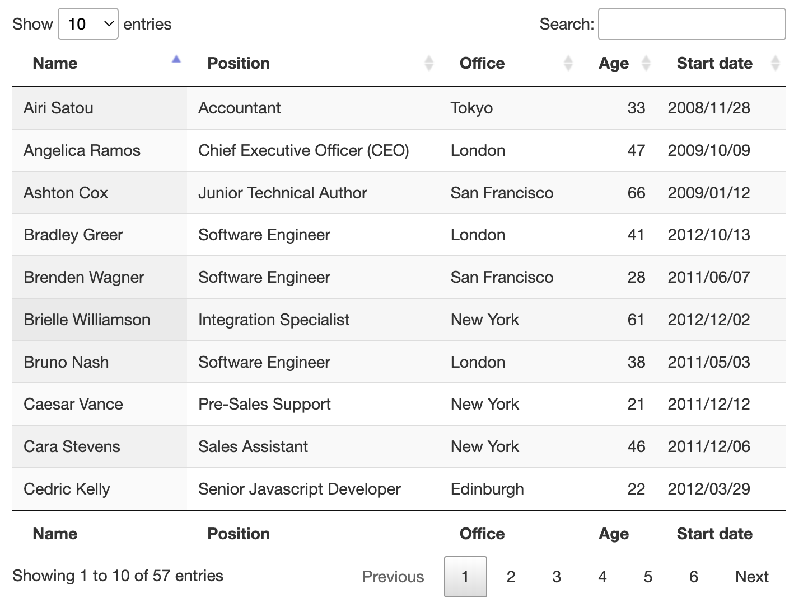
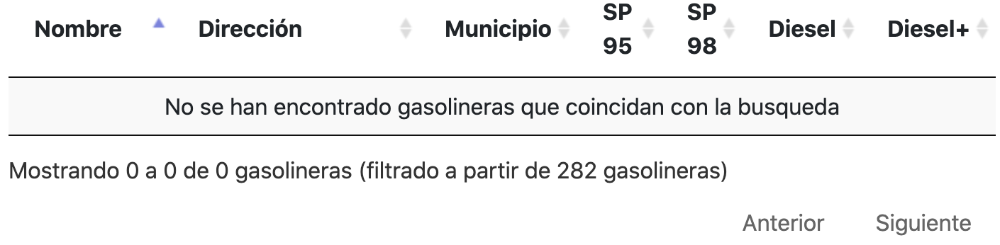
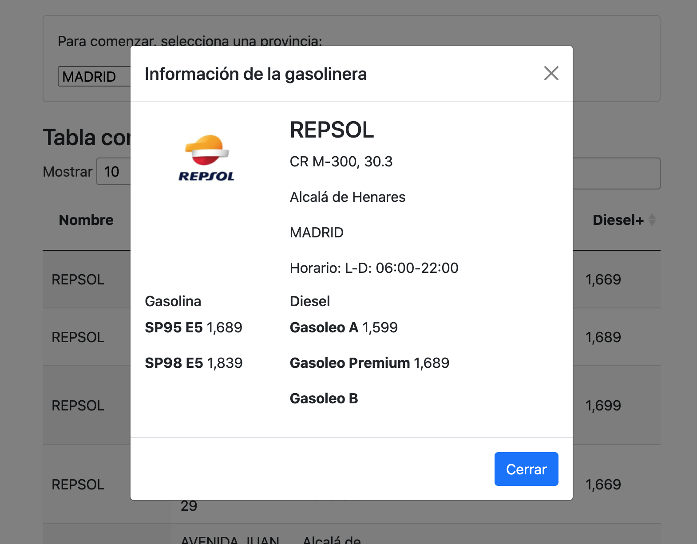

# Practica 4: Consume un API REST JSON y visualizalo en un documento web

#### Introducción
**Acceso a la web:** https://joserra20.github.io/p4web/

Para esta práctica he elegido crear un sitio web en el que se pueda consultar los precios del combustible de cada una de las 11600 gasolineras que hay en España. El diseño de la herramienta es bastante sencillo, aunque también he buscado probar varios elementos que me proporciona el framework CSS Bootstrap y JavaScript.
#### La API

He empleado una API del Ministerio de Industria, Comercio y Turismo que ofrece datos actualizados sobre los precios del carburante así como un listado de todas las gasolineras. También proporciona listado de CCAA, provincias y tipos de carburantes.
No hay mucha información sobre esta API, pero tras algunas búsquedas localice estas páginas en la que se explica como usarla.
https://sedeaplicaciones.minetur.gob.es/ServiciosRESTCarburantes/PreciosCarburantes/help/operations/PreciosEESSTerrestres#response-json
https://sedeaplicaciones.minetur.gob.es/ServiciosRESTCarburantes/PreciosCarburantes/help
#### API para logotipos

Además de la API principal, he utilizado otra API llamada Clearbit Logo API (https://clearbit.com/logo) para intentar conseguir los logotipos de las empresas de las gasolineras de forma sencilla.
#### DataTables

Otra herramienta que he empleado en la práctica es DataTables (https://datatables.net/). Se trata de un plugin para jQuery que abre un mundo de posibilidades a la hora de crear y gestionar tablas. Permite añadir con facilidad paginación, una barra de búsqueda y ordenado por columnas (muy útil para ordenar por precio).
#### Funcionamiento
Dado que descargar el JSON completo con todas las gasolineras era demasiado grande (alrededor de 8 MBytes), decidí que lo mejor era realizar un primer filtrado de los datos por provincia, además la API lo permitía.
##### Carga de las provincias
Como vamos a realizar una petición filtrando por provincia, primero se realiza una petición para obtener un JSON con todas las provincias y su código asociado que será utilizado para realizar la llamada a la API de los precios.
##### Inicialización de la tablas
Sobre las DataTables, cabe destacar que se ha configurado para que sea **responsive** y también se han modificado los mensajes por defecto por mensajes **en español y personalizados para aplicación** como por ejemplo, cuando no se encuentra ningún resultado que se muestra el siguiente mensaje:

##### Información ampliada al hacer click

Si se hace click en alguna fila de la tabla, se lanza una ventana Modal (https://getbootstrap.com/docs/5.1/components/modal/) de Bootstrap que contiene información ampliada sobre la gasolinera seleccionada.
##### Visualización alternativa en forma de grid
De forma alternativa a visualizar la búsqueda en la tabla, también se muestran todos los resultados en forma de grid con su logotipo (generado por API) y con un logo por defecto en caso de no encontrarse ningún logotipo.
